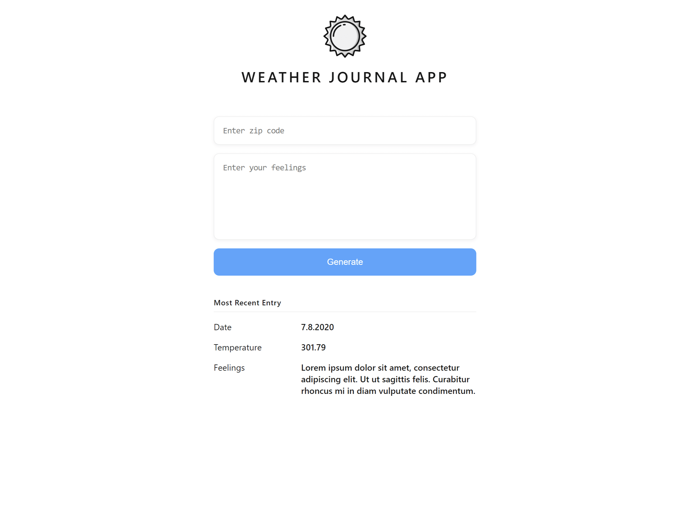

# Weather-Journal App Project

This project for Udacity's [Front End Web Developer Nanodegree Program](https://www.udacity.com/course/front-end-web-developer-nanodegree--nd0011).

## Overview

The project requires to create an asynchronous web app that uses Web API and user data to dynamically update the UI for a Weather-Journal App.

## Screenshot

