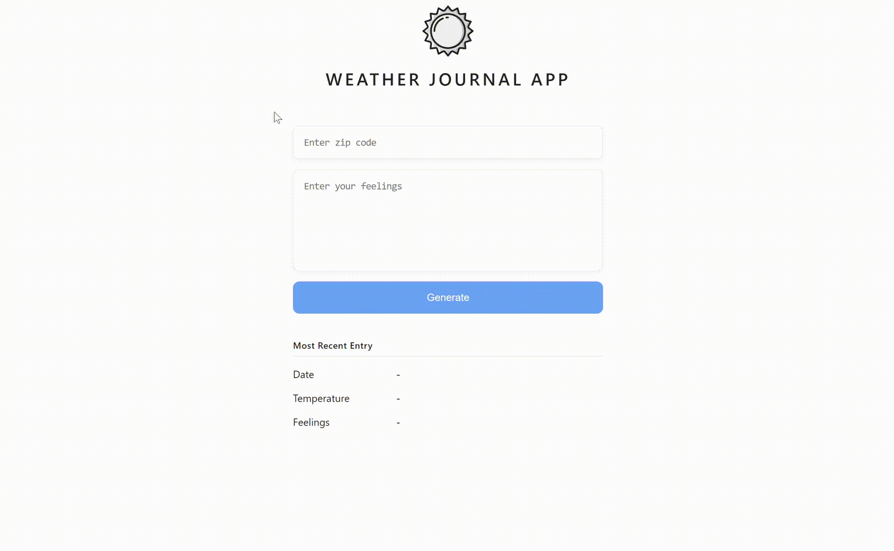

# Weather-Journal App Project

> This project is for Udacity's [Front End Web Developer Nanodegree Program](https://www.udacity.com/course/front-end-web-developer-nanodegree--nd0011).

The project requires to create an asynchronous web app that uses OpenWeatherMap API to fetch weather data based on user's inputs and update the UI dynamically.



## Getting Started

### Prerequisites

In this project we are using Node development environment. Node.js and the Node Package Manager (NPM) should be installed on the local machine. In addition, acquire API credentials from OpenWeatherMap service to fetch weather data.

### Installing

To setup local development environment, clone this repo on your machine, navigate to its location in the terminal and run

```
npm install
```

Run `npm start` to running local server on `http://localhost:3000`.

## Dependencies

- [Express](https://expressjs.com/) - minimalist web framework for node.js
- [Body-Parser](http://expressjs.com/en/resources/middleware/body-parser.html) - Node.js body parsing middleware
- [CORS](http://expressjs.com/en/resources/middleware/cors.html) - A Connect/Express middleware that can be used to enable CORS with various options
- [Morgan](http://expressjs.com/en/resources/middleware/morgan.html) - HTTP request logger middleware for node.js

## License

This project is licensed under the MIT License - see the [LICENSE.md](./LICENSE) file for details
